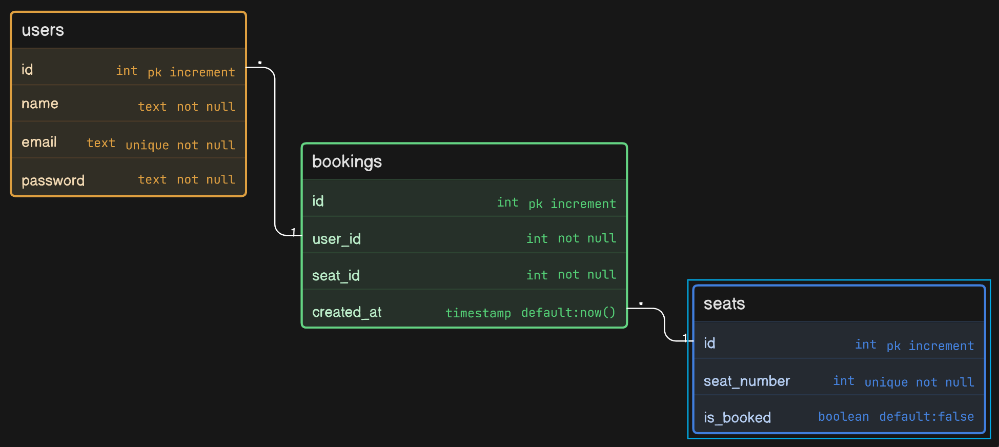

# Book My Ticket

This is a backend project for the Backend Ninja hackathon track.

The main goal is simple:

- users can register
- users can login
- only logged-in users can book seats
- same seat cannot be booked two times

## What This Project Does

- Creates user accounts
- Logs users in and gives a JWT token
- Protects booking API with auth middleware
- Lets users see seats and book a seat
- Saves which user booked which seat

## Tech Used

- Node.js
- Express.js
- PostgreSQL
- bcrypt
- JWT (jsonwebtoken)

## Folder Structure

```text
book-my-show/
  src/
    app.js
    server.js
    auth/
    booking/
    db/
    assets/
```

## Database Design



Tables used:

- users
- seats
- bookings

Relations:

- bookings.user_id -> users.id
- bookings.seat_id -> seats.id

## How Duplicate Booking Is Prevented

- Seat row is locked in transaction (`SELECT ... FOR UPDATE`)
- A unique index is also used on bookings seat_id

This means even if two requests come at the same time, only one can win.

## Setup (Very Easy)

1. Go to source folder

```bash
cd src
```

2. Install packages

```bash
npm install
```

3. Create `.env` file inside `src`

Use this template:

```env
PORT=8080
JWT_SECRET=replace-with-a-long-random-secret
NODE_ENV=development

PGUSER=postgres
PGHOST=localhost
PGDATABASE=booking
PGPASSWORD=postgres
PGPORT=5432
```

4. Run migration

```bash
npm run migrate
```

5. Start server

```bash
npm run dev
```

Server URL:
http://localhost:8080

## API List

- GET /health
- POST /auth/register
- POST /auth/login
- GET /booking/seats
- POST /booking/book/:seatId (protected)

## Easy API Test (Step by Step)

If cURL feels hard, use Postman. It is much easier.

### Step 1: Check server is running

Open this in browser:

- http://localhost:8080/health

You should see: `{ "status": "ok" }`

### Step 2: Register user (Postman)

1. Open Postman
2. Method: `POST`
3. URL: `http://localhost:8080/auth/register`
4. Go to `Body` -> `raw` -> `JSON`
5. Paste:

```json
{
  "name": "Alice",
  "email": "alice@example.com",
  "password": "password123"
}
```

6. Click `Send`

### Step 3: Login user (Postman)

1. Method: `POST`
2. URL: `http://localhost:8080/auth/login`
3. Body -> `raw` -> `JSON`
4. Paste:

```json
{
  "email": "alice@example.com",
  "password": "password123"
}
```

5. Click `Send`
6. Copy `token` from response

### Step 4: Get seats

1. Method: `GET`
2. URL: `http://localhost:8080/booking/seats`
3. Click `Send`

### Step 5: Book a seat (Protected API)

1. Method: `POST`
2. URL: `http://localhost:8080/booking/book/10`
3. Go to `Headers`
4. Add:

- Key: `Authorization`
- Value: `Bearer YOUR_TOKEN_HERE`

5. Click `Send`

If same seat is already booked, you will get status `409`.

## Hackathon Checklist Coverage

- Authentication implementation: Done
- Protected routes: Done
- Booking logic correctness: Done
- Clean code structure: Done
- Integration with existing code: Done
- Frontend: Optional (not included)
